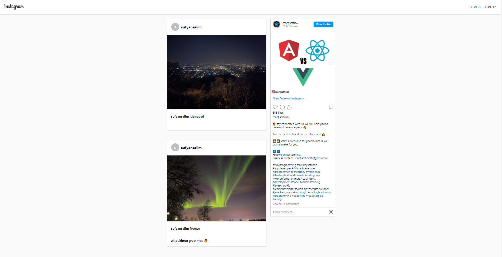

# Instagram Clone

## React + Material UI + Firebase



## [Live Site](https://instagram-efa0a.web.app/)

# Usage
Replace "" in firebase.js ,<br />
and "post-url" , '"appid|client key" in App.js file the InstagramEmbed Component props to ur own crediantials<br />


## Install Dependencies
```
npm install
```

## Run App
```
npm start
```